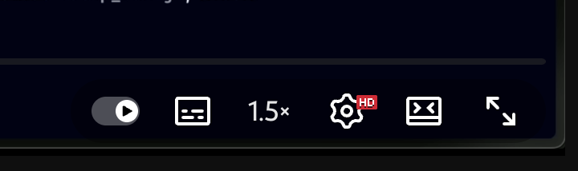
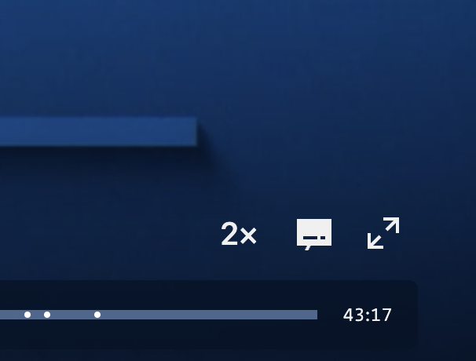

# Video Playback Speed Controller

[](https://opensource.org/licenses/MIT)
[](https://developer.chrome.com/docs/extensions/)
[](https://www.typescriptlang.org/)

**Free YouTube playback speed control** — bypass YouTube Premium speed restrictions! A Chrome extension that lets you control video playback speed on **YouTube** and **NRK TV** using the native HTML5 video API.

> 🚀 **YouTube removed free playback speed controls?** This extension brings them back — and adds speeds up to 3×!

**Norwegian / Norsk**: Gratis avspillingshastighet for YouTube — omgå YouTube Premium-begrensninger! En Chrome-utvidelse som lar deg kontrollere avspillingshastigheten på YouTube og NRK TV.

**Keywords**: youtube speed control, youtube playback speed, youtube 2x speed, youtube 3x speed, video speed controller, youtube premium alternative, free youtube speed, nrk tv speed, html5 video speed, chrome extension video speed

## Screenshots

| YouTube                                                 | NRK TV                                      |
| ------------------------------------------------------- | ------------------------------------------- |
|  |  |

## Features

- 🎬 **Free YouTube speed control** — no Premium subscription required
- ⚡ **Extended speeds**: 1×, 1.25×, 1.5×, 1.75×, 2×, 2.5×, 3× (faster than YouTube allows!)
- 🎯 **In-player button** — click to cycle through speeds without leaving the video
- 💾 **Remembers your preference** — speed syncs across all your devices via Chrome
- 🔄 **Works everywhere** — handles YouTube's SPA navigation and dynamic video loading
- 🔓 **Cannot be blocked** — uses native HTML5 `playbackRate` API that websites can't restrict
- 🇳🇴 **NRK TV support** — also works on Norwegian Broadcasting (NRK) videos

## Supported Sites

| Site                                   | Status          |
| -------------------------------------- | --------------- |
| [youtube.com](https://www.youtube.com) | ✅ Full support |
| [tv.nrk.no](https://tv.nrk.no)         | ✅ Full support |

## Installation

### Manual Installation (Developer Mode)

1. Download or clone this repository
2. Run `npm install && npm run build` to compile TypeScript
3. Open Chrome and navigate to `chrome://extensions/`
4. Enable "Developer mode" in the top right
5. Click "Load unpacked" and select the extension directory

## Usage

### On YouTube

1. Navigate to any YouTube video
2. Start playing the video
3. Look for the speed indicator (e.g., "1×") in the player controls (left of settings button)
4. **Click the indicator** to cycle through speeds: 1× → 1.25× → 1.5× → 1.75× → 2× → 2.5× → 3×
5. Or use the **extension popup** in Chrome toolbar to select a speed

### On NRK TV

1. Navigate to [tv.nrk.no](https://tv.nrk.no) or any NRK video page
2. Start playing a video
3. Look for the speed indicator in the player controls
4. Click to cycle speeds, or use the extension popup

## Why This Extension?

### YouTube Speed Control Without Premium

YouTube has placed playback speed controls behind a paywall (YouTube Premium). Many users want to:

- Watch educational videos faster (2× or 3× speed)
- Save time on long tutorials and lectures
- Control playback speed without paying for Premium

This extension uses the browser's native `HTMLVideoElement.playbackRate` API, which **cannot be restricted** by any website. It's a standard web API built into every browser.

### How is this different from other extensions?

- ✅ **Lightweight** — minimal code, no bloat
- ✅ **Open source** — fully transparent, no tracking
- ✅ **In-player controls** — no need to open popup menus
- ✅ **Higher speeds** — go up to 3× (YouTube only offers up to 2×)
- ✅ **Works on NRK** — bonus support for Norwegian viewers

## Development

```bash
# Install dependencies
npm install

# Build the extension
npm run build

# Watch for changes during development
npm run watch

# Bump version and build
npm run bump
```

### Project Structure

```
nrkPlaybackSpeed/
├── manifest.json          # Extension manifest
├── popup.html             # Extension popup interface
├── popup.ts               # Popup logic (TypeScript)
├── speed.ts               # Content script for NRK
├── speed-youtube.ts       # Content script for YouTube
├── package.json           # Node.js dependencies
├── tsconfig.json          # TypeScript configuration
└── bump-version.js        # Version management script
```

### Files Description

- **`manifest.json`**: Chrome extension configuration and metadata
- **`popup.html`**: The HTML for the extension's popup interface
- **`popup.ts`**: TypeScript code for the popup functionality
- **`speed.ts`**: Content script that runs on NRK pages
- **`speed-youtube.ts`**: Content script that runs on YouTube pages
- **`bump-version.js`**: Utility script for version management

### Permissions

The extension requires the following permissions:

- **`scripting`**: To inject content scripts
- **`activeTab`**: To interact with the currently active tab
- **`storage`**: To save user preferences
- **Host permissions**: Access to `*.nrk.no` and `*.youtube.com` domains

## How It Works

The extension injects a content script that:

1. Finds all `<video>` elements on the page
2. Sets the `playbackRate` property to your desired speed
3. Adds a visual speed indicator to the player controls
4. Persists your preference using Chrome's sync storage

This works because `playbackRate` is a standard HTML5 Video API that browsers expose regardless of what the website wants to allow.

## Contributing

1. Fork the repository
2. Create a feature branch
3. Make your changes
4. Test thoroughly on both YouTube and NRK
5. Submit a pull request

## License

This project is licensed under the [MIT License](LICENSE) — free for personal and commercial use.

## Support

If you encounter any issues:

1. Check that you're on a supported page (YouTube or NRK)
2. Refresh the page and try again
3. Make sure the video player has fully loaded
4. Report issues through the repository's issue tracker

---

## Related Keywords

`youtube speed control` `youtube playback speed extension` `youtube 2x speed free` `youtube 3x speed` `video speed controller chrome` `youtube premium alternative` `free youtube speed control` `html5 video playback rate` `nrk tv hastighet` `avspillingshastighet youtube` `chrome extension video speed`

---

**Disclaimer**: This extension is unofficial and not affiliated with YouTube, Google, or NRK (Norwegian Broadcasting Corporation). It uses standard web APIs that are part of every modern browser.
